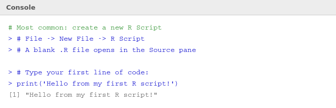
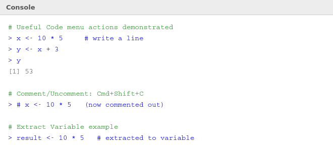

# 🗃️ 03b — RStudio Menus: File and Code

> **Author:** RP &nbsp;|&nbsp; [@priyasaivasan](https://github.com/priyasaivasan)

---

## 🧠 Why Learn the Menus?

RStudio has a lot of menu options — most beginners ignore them and miss out on features that save a lot of time. This page walks through the two most important menus: **File** and **Code**.

---

## 📁 File → New File

This is where you create any new file in RStudio. The most important ones for you right now:

| File Type | What it is | When to use |
|-----------|-----------|-------------|
| **R Script** | Plain `.R` file for writing R code | Every day — your main working file |
| **R Markdown** | Mix code + text to produce reports | When you want a formatted output (PDF, HTML) |
| **Quarto Document** | Modern, improved version of R Markdown | Same as above — newer and more powerful |
| **Quarto Presentation** | Creates slides from R code + text | Presentations and demos |
| **R Notebook** | Like R Markdown but previews inline | Quick exploratory work |
| **Shiny Web App** | Build interactive web apps in R | When you want to share results interactively |
| **Plumber API** | Turn R code into a web API | Advanced — sharing R functions over the web |
| **Markdown File** | Plain formatted text (like GitHub README) | Documentation, notes |
| **Python Script** | Write Python inside RStudio | When mixing R and Python |
| **SQL Script** | Database queries | When connecting R to a database |
| **Text File** | Plain unformatted text | Simple notes |

> 💡 **As a beginner, you only need two:** `R Script` for daily coding and `R Markdown` or `Quarto Document` when you want to produce a nice report or assignment.

### Creating Your First R Script

**Steps:**
1. Click **File → New File → R Script** (or press `Cmd+Shift+N` on Mac / `Ctrl+Shift+N` on Windows)
2. A blank file opens in the **Source pane** (top left)
3. Type your code
4. Press `Cmd+Enter` / `Ctrl+Enter` to run a line
5. Save with `Cmd+S` / `Ctrl+S` — give it a `.R` extension e.g. `my_first_script.R`

---

## ⌨️ Code Menu

The Code menu gives you shortcuts and tools to write better code faster.

| Option | Shortcut (Mac) | Shortcut (Win) | What it does |
|--------|---------------|----------------|-------------|
| **Insert Section** | `Cmd+Shift+R` | `Ctrl+Shift+R` | Adds a named divider to organise your script into sections |
| **Jump To** | `Cmd+Option+J` | `Ctrl+Alt+J` | Jump to a specific line or function |
| **Go To File/Function** | `Cmd+.` | `Ctrl+.` | Search any file or function across your project |
| **Show Document Outline** | `Cmd+Shift+O` | `Ctrl+Shift+O` | Shows a sidebar outline of your script's sections |
| **Soft Wrap Long Lines** | — | — | Wraps long lines so you don't scroll sideways |
| **Rainbow Parentheses** | — | — | Colours matching brackets in pairs — very helpful! |
| **Show Diagnostics** | — | — | Highlights errors and warnings as you type |
| **Go To Help** | `F1` | `F1` | Opens help for the function your cursor is on |
| **Extract Function** | `Cmd+Option+X` | `Ctrl+Alt+X` | Turns selected code into a reusable function |
| **Extract Variable** | `Cmd+Option+V` | `Ctrl+Alt+V` | Turns a value into a named variable |
| **Rename in Scope** | `Cmd+Option+Shift+M` | `Ctrl+Alt+Shift+M` | Renames a variable everywhere in your script at once |
| **Comment/Uncomment** | `Cmd+Shift+C` | `Ctrl+Shift+C` | Adds/removes `#` on selected lines |
| **Run Selected Lines** | `Cmd+Return` | `Ctrl+Enter` | Runs highlighted lines only |
| **Re-Run Previous** | `Cmd+Option+P` | `Ctrl+Alt+P` | Runs the last command again |
| **Source** | `Cmd+Shift+S` | `Ctrl+Shift+S` | Runs entire script silently |
| **Source with Echo** | `Cmd+Shift+Return` | `Ctrl+Shift+Enter` | Runs entire script and prints each line |

---

## ⭐ The Ones You'll Use Most as a Beginner

1. **`Cmd+Shift+N`** — New R Script (start fresh)
2. **`Cmd+Enter`** — Run current line (your most-used shortcut)
3. **`Cmd+Shift+C`** — Comment/uncomment lines
4. **`F1`** — Get help on any function instantly
5. **Rainbow Parentheses** — Turn this on once via Code menu and leave it on

---

## ⬅️ [Back: R Environment](03_environment.md) &nbsp;|&nbsp; [➡️ Next: Syntax & Data Types](04_syntax_datatypes.md)
