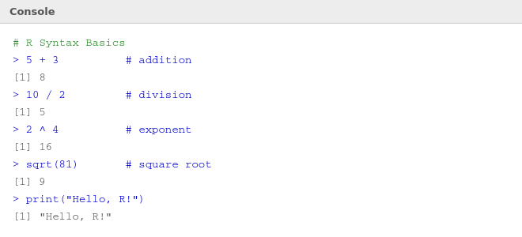
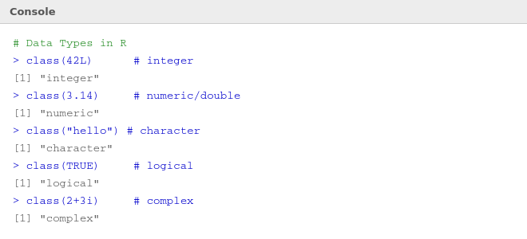

# 🔤 04 — R Syntax and Data Types

> **Author:** RP &nbsp;|&nbsp; [@priyasaivasan](https://github.com/priyasaivasan)

---

## 🧠 Before You Code — How R Reads Your Instructions

R reads your code **line by line**, from top to bottom. A few golden rules:

- Lines starting with `#` are **comments** — R ignores them, they're notes for you
- The `>` symbol in the Console means R is **ready and waiting** for input
- The `+` symbol means R knows your code **isn't finished yet** (e.g. inside a bracket)
- R is **case-sensitive** — `Name` and `name` are two different things

---

## ➕ Basic Syntax — Arithmetic

> **What's happening:** R works like a calculator. Type an expression, press Enter, get the answer.



| Operator | Meaning | Example | Result |
|----------|---------|---------|--------|
| `+` | Add | `5 + 3` | `8` |
| `-` | Subtract | `10 - 4` | `6` |
| `*` | Multiply | `3 * 4` | `12` |
| `/` | Divide | `10 / 2` | `5` |
| `^` | Power | `2 ^ 4` | `16` |
| `%%` | Modulo (remainder) | `10 %% 3` | `1` |
| `%/%` | Integer divide | `10 %/% 3` | `3` |

---

## 🏷️ Data Types

> **What's happening:** Every value in R has a *type*. R needs to know whether it's working with numbers, text, or true/false values. These are the 5 core types.



### The 5 Core Types

| Type | Example | `class()` returns | Used for |
|------|---------|------------------|----------|
| **Integer** | `42L` | `"integer"` | Whole numbers (the `L` tells R it's integer) |
| **Numeric** | `3.14` | `"numeric"` | Decimal numbers |
| **Character** | `"hello"` | `"character"` | Text (always in quotes) |
| **Logical** | `TRUE` / `FALSE` | `"logical"` | Yes/no, true/false values |
| **Complex** | `2+3i` | `"complex"` | Complex numbers (rare in practice) |

### Type Hierarchy (Coercion Order)
```
logical  →  integer  →  double  →  character
  ↑ simplest                    ↑ most complex
```
When R mixes types, it converts everything to the *most complex* type in the mix.

### Useful Type Functions
```r
class(x)        # what type is x?
typeof(x)       # more detailed type info
is.numeric(x)   # TRUE or FALSE
as.character(x) # convert to character
as.numeric(x)   # convert to number
as.logical(x)   # convert to TRUE/FALSE
```

---

## 💡 Tips & Gotchas

> ⚠️ `TRUE` and `FALSE` must be **ALL CAPS** in R. `True` or `true` will throw an error.

> ⚠️ Text (character) values must always be wrapped in `"quotes"` — without them R thinks it's a variable name.

> 💡 Use `class()` whenever you're unsure what type something is — it's your best diagnostic tool.

---

## ⬅️ [Back: Environment](03_environment.md) &nbsp;|&nbsp; [➡️ Next: Variables, Vectors & Matrices](05_variables_vectors_matrices.md)
