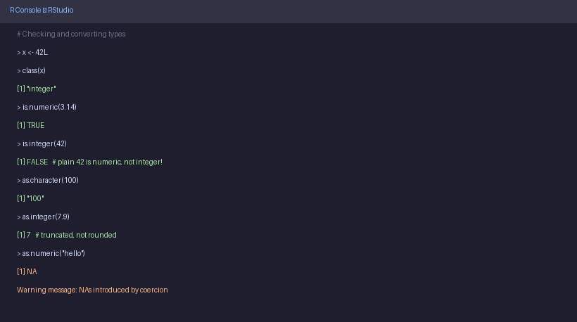
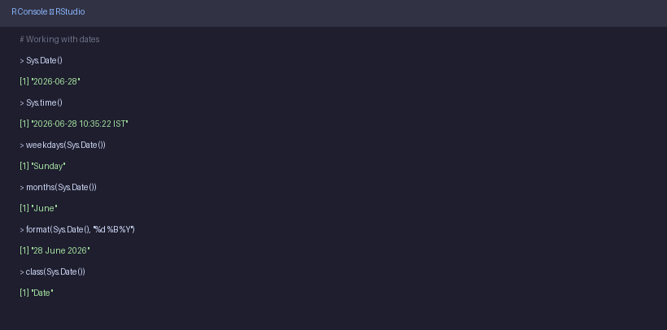

# 🔢 R Syntax & Data Types

> **Author:** RP &nbsp;|&nbsp; [@priyasaivasan](https://github.com/priyasaivasan)

---

# Part 1 — Understanding the Concept

## What is R Syntax?

Every programming language has a grammar — a set of rules that tells the computer how to read your instructions. In R, this grammar is called **syntax**. When you type something in the RStudio console and press Enter, R reads your line, checks if it makes sense according to its rules, and either gives you a result or an error.

Here are the most important rules to know from the start:

- **Each line is one instruction.** R reads one line at a time and executes it immediately.
- **The `#` symbol starts a comment.** Anything after `#` on a line is ignored by R — it's a note for humans, not the computer.
- **Spaces don't matter (mostly).** `2+3` and `2 + 3` produce the same result. Use spaces to make your code readable.
- **R is case-sensitive.** `Score`, `score`, and `SCORE` are three completely different things to R.
- **Errors are normal.** When R gives an error, it's telling you exactly what it didn't understand. Read error messages — they're helpful, not scary.

### Arithmetic in R

R can be used as a calculator right from the console. Here are all the arithmetic operators you'll need:

| Operator | Meaning | Example | Result |
|----------|---------|---------|--------|
| `+` | Add | `5 + 3` | `8` |
| `-` | Subtract | `10 - 4` | `6` |
| `*` | Multiply | `3 * 4` | `12` |
| `/` | Divide | `10 / 2` | `5` |
| `^` | Power (exponent) | `2 ^ 4` | `16` |
| `%%` | Modulo — gives the remainder | `10 %% 3` | `1` |
| `%/%` | Integer division — drops the decimal | `10 %/% 3` | `3` |

The modulo (`%%`) and integer division (`%/%`) are ones students often haven't seen before. Modulo gives you what's left over after dividing. For example, `10 %% 3` is `1` because 3 goes into 10 three times (giving 9), and 1 is left over. This is useful for checking if a number is even or odd: if `x %% 2 == 0`, the number is even.

---

## What Are Data Types?

Every single value in R has a **type** — a category that tells R what kind of thing it is and what operations make sense on it. You can't subtract one person's name from another, but you can subtract two numbers. R uses types to enforce this logic.

There are **5 core data types** in R:

### 1. Numeric
The default type for any number with or without a decimal. When you type `42` or `3.14`, R stores it as numeric.
```r
class(42)      # "numeric"
class(3.14)    # "numeric"
```

### 2. Integer
A whole number stored more efficiently than numeric. You signal an integer by adding an `L` after the number. In practice, R often promotes integers to numeric automatically, so you may not use this often — but you'll encounter it when reading data.
```r
class(42L)     # "integer"
class(42)      # "numeric"  — without L, it's numeric
```

### 3. Character
Any text — words, sentences, names, labels. **Must always be surrounded by quotes** (single or double). Without quotes, R thinks you're referring to a variable.
```r
class("hello")       # "character"
class("Priya")       # "character"
class("3.14")        # "character" — the quotes make it text, not a number!
```

### 4. Logical
Can only be `TRUE` or `FALSE` — nothing else. These come up constantly in conditions and comparisons. **Must be in ALL CAPS** — `True` will cause an error.
```r
class(TRUE)    # "logical"
class(FALSE)   # "logical"
```

### 5. Complex
Numbers with an imaginary part (like in mathematics). Rare in everyday data analysis — you'll mostly see this in scientific computing.
```r
class(2 + 3i)  # "complex"
```

### The Type Hierarchy

When R is forced to combine values of different types (say, a number and a word in the same container), it converts everything to the most flexible type. This is called **coercion**, and it happens automatically — sometimes in ways that surprise beginners. The hierarchy goes:

```
logical  →  integer  →  numeric  →  character
 least flexible                    most flexible
```

**Example:** If you mix a number and a word, everything becomes character:
```r
c(1, 2, "three")
# [1] "1"     "2"     "three"
```
R silently turned `1` and `2` into `"1"` and `"2"`. This is a common source of bugs — always check your types.

---

## Checking and Converting Types

R gives you a clear set of functions to inspect and change types. These are among the most-used functions in all of R.

### Functions for Checking Type

| Function | What it does |
|----------|-------------|
| `class(x)` | Returns the high-level category of `x` — what you'll use 90% of the time |
| `typeof(x)` | Returns R's internal storage type — more detailed, less commonly needed |
| `is.numeric(x)` | Returns `TRUE` if `x` is numeric, `FALSE` otherwise |
| `is.character(x)` | Returns `TRUE` if `x` is character |
| `is.logical(x)` | Returns `TRUE` if `x` is logical |
| `is.integer(x)` | Returns `TRUE` if `x` is integer |

### Functions for Converting Type

| Function | What it does |
|----------|-------------|
| `as.numeric(x)` | Converts `x` to numeric |
| `as.character(x)` | Converts `x` to character (text) |
| `as.logical(x)` | Converts `x` to TRUE/FALSE |
| `as.integer(x)` | Converts `x` to integer — note: it **truncates**, doesn't round |

**Important behaviours to know:**
- `as.integer(3.99)` gives `3`, not `4` — it chops the decimal off
- `as.logical(0)` gives `FALSE`; `as.logical(1)` gives `TRUE`; any non-zero number gives `TRUE`
- `as.numeric("hello")` gives `NA` with a warning — R cannot turn a word into a number

---

## Working with Dates & Time

R has built-in functions to retrieve and work with today's date, current time, day of the week, and month. These are easy to use and come up constantly in real-world data work — things like filtering data to today's records, labelling a report with the current date, or calculating how many days since an event.

### Key Date Functions

| Function | What it returns |
|----------|----------------|
| `Sys.Date()` | Today's date (Year-Month-Day format) |
| `Sys.time()` | Current date and time, including timezone |
| `weekdays(Sys.Date())` | Name of today's day ("Monday", "Tuesday", ...) |
| `months(Sys.Date())` | Name of the current month ("January", ...) |
| `format(Sys.Date(), "...")` | Date in your custom format using format codes |

### Format Codes

When using `format()`, you use special codes inside quotes to control how the date looks:

| Code | Meaning | Example output |
|------|---------|----------------|
| `%d` | Day as a number | `28` |
| `%m` | Month as a number | `06` |
| `%B` | Full month name | `June` |
| `%Y` | 4-digit year | `2026` |
| `%A` | Full weekday name | `Sunday` |

---

# Part 2 — Hands-On

## Try These in RStudio


```r
# Basic arithmetic
5 + 3          # [1] 8
10 %% 3        # [1] 1   — remainder when 10 is divided by 3
2 ^ 8          # [1] 256
```


```r
# Checking types
class(42)          # [1] "numeric"
class(42L)         # [1] "integer"
class("Priya")     # [1] "character"
class(TRUE)        # [1] "logical"

# is. functions
is.numeric(3.14)   # [1] TRUE
is.integer(42)     # [1] FALSE  — surprise! plain 42 is numeric
is.integer(42L)    # [1] TRUE
```



```r
# Converting types
as.character(100)    # [1] "100"
as.numeric("3.14")  # [1] 3.14
as.integer(7.9)     # [1] 7     — truncated, not rounded
as.logical(0)       # [1] FALSE
as.logical(5)       # [1] TRUE

# What happens with impossible conversions?
as.numeric("hello") # [1] NA   — with a warning
```



```r
# Dates and time
Sys.Date()                          # [1] "2026-06-28"
Sys.time()                          # [1] "2026-06-28 10:35:22 IST"
weekdays(Sys.Date())                # [1] "Sunday"
months(Sys.Date())                  # [1] "June"
format(Sys.Date(), "%d %B %Y")     # [1] "28 June 2026"
class(Sys.Date())                   # [1] "Date"
```

---

# Part 3 — Exercises

---

## ### Exercise 1 — Arithmetic

> **What is the result of `17 %% 5`? What does this tell you about 17 divided by 5?**

&nbsp;

&nbsp;

&nbsp;

```r
17 %% 5
# [1] 2
# 5 goes into 17 three times (giving 15), and 2 is left over.
```

---

## ### Exercise 2 — Spotting the Type

> **Without running the code, predict what `class()` will return for each of these. Then run them to check:**
> ```r
> class(99)
> class(99L)
> class("99")
> class(FALSE)
> ```

&nbsp;

&nbsp;

&nbsp;

```r
class(99)       # "numeric"
class(99L)      # "integer"
class("99")     # "character"  — the quotes make it text!
class(FALSE)    # "logical"
```

---

## ### Exercise 3 — Type Conversion Surprise

> **What does `as.integer(9.99)` return? Is it `9` or `10`? Why?**

&nbsp;

&nbsp;

&nbsp;

```r
as.integer(9.99)
# [1] 9
# as.integer() truncates — it cuts off everything after the decimal point.
# It does NOT round. So 9.99 becomes 9, not 10.
```

---

## ### Exercise 4 — Dates

> **Write code to print today's date in this format: `"28-Jun-2026"` (day-abbreviated month-year). Hint: use `%b` for abbreviated month name.**

&nbsp;

&nbsp;

&nbsp;

```r
format(Sys.Date(), "%d-%b-%Y")
# [1] "28-Jun-2026"
```

---

## ⬅️ [Back: RStudio Menus](03b_rstudio_menus.md) &nbsp;|&nbsp; [➡️ Next: Variables](05_variables.md)
