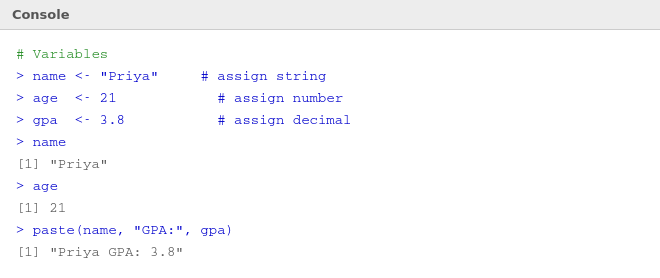

# 📦 05 — Variables

> **Author:** RP &nbsp;|&nbsp; [@priyasaivasan](https://github.com/priyasaivasan)

---

## 📌 What is a Variable?

> **In plain English:** A variable is a named box that holds a value. You give the box a name, put something inside, and whenever you need that value later, you just use the name.

Think of it like labelling jars in a kitchen. Instead of remembering that the third jar on the left has sugar, you label it `sugar` — and from then on you just say "give me `sugar`."

In R, you put values into named boxes using the `<-` arrow (read it as "gets").

---

## 🖥️ Examples in RStudio



```r
# Assign values to variables
name  <- "Priya"
age   <- 21
gpa   <- 3.8
pass  <- TRUE

# Use the variables
name
# [1] "Priya"

age + 5
# [1] 26

paste(name, "has a GPA of", gpa)
# [1] "Priya has a GPA of 3.8"

# Check the type
class(name)
# [1] "character"

class(gpa)
# [1] "numeric"

class(pass)
# [1] "logical"
```

### Naming Rules

| ✅ Valid | ❌ Invalid | Why invalid |
|---------|-----------|-------------|
| `my_score` | `my score` | No spaces allowed |
| `score1` | `1score` | Can't start with a number |
| `is.valid` | `is-valid` | Hyphen not allowed |
| `firstName` | `first name` | No spaces |

> 💡 **`<-` vs `=`:** Both work for assignment in R, but `<-` is the community standard. Use `<-` to be consistent with everyone else's R code.

> 💡 **R is case-sensitive.** `Score` and `score` are two completely different variables.

---

## ✏️ Try It Yourself

**Exercise — Variables & Arithmetic**

In your RStudio console, try the following:

1. Create a variable `city` and assign it the name of your city.
2. Create a variable `temp_celsius` and set it to `38`.
3. Convert it to Fahrenheit using the formula: `(temp_celsius * 9/5) + 32` and store the result in a variable called `temp_fahrenheit`.
4. Print `temp_fahrenheit`.
5. What is `class(city)`? What is `class(temp_celsius)`?

<details>
<summary>💡 Click to reveal answers</summary>

```r
city <- "Bengaluru"        # or your own city
temp_celsius <- 38
temp_fahrenheit <- (temp_celsius * 9/5) + 32
temp_fahrenheit
# [1] 100.4

class(city)
# [1] "character"

class(temp_celsius)
# [1] "numeric"
```

</details>

---

## ⬅️ [Back: Data Types](04_syntax_datatypes.md) &nbsp;|&nbsp; [➡️ Next: Vectors](05b_vectors.md)
