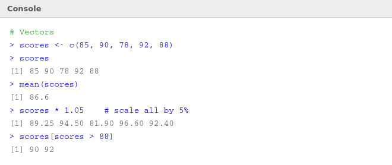
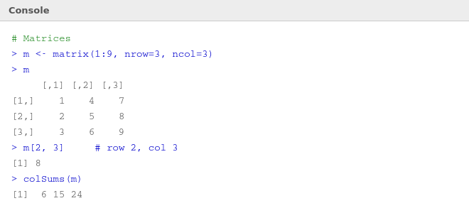

# 📦 05 — Variables, Vectors and Matrices

> **Author:** RP &nbsp;|&nbsp; [@priyasaivasan](https://github.com/priyasaivasan)

---

## 📌 Variables

> **What's happening:** A variable is a named box that stores a value. In R, you assign values using `<-` (read as "gets"). You can name a variable almost anything — just start with a letter, no spaces.


```r
# Assign values
name  <- "Priya"
age   <- 21
gpa   <- 3.8
pass  <- TRUE

# Use them
paste(name, "GPA:", gpa)
# [1] "Priya GPA: 3.8"
```

> 💡 **Why `<-` and not `=`?** R accepts both, but `<-` is the community standard for assignment. Use `=` only inside function arguments.

---

## 📊 Vectors

> **What's happening:** A vector is R's most basic data structure — an ordered collection of values, all of the **same type**. Even a single number is a vector of length 1 in R.



### Creating Vectors
```r
scores <- c(85, 90, 78, 92, 88)   # numeric vector
names  <- c("Ali", "Bob", "Cara") # character vector
flags  <- c(TRUE, FALSE, TRUE)    # logical vector
```

### Key Vector Operations

| Operation | Code | Result |
|-----------|------|--------|
| Length | `length(scores)` | `5` |
| Mean | `mean(scores)` | `86.6` |
| Sum | `sum(scores)` | `433` |
| Max / Min | `max(scores)` | `92` |
| Scale all | `scores * 1.05` | each × 1.05 |
| Filter | `scores[scores > 88]` | `90 92` |
| By index | `scores[2]` | `90` |
| By range | `scores[1:3]` | `85 90 78` |
| Exclude | `scores[-1]` | all except first |

### Why Vectors Matter
```r
# Without vectorisation (other languages):
# for each element, multiply by 2...

# With R vectorisation:
scores * 2   # R does this instantly for ALL elements
# [1] 170 180 156 184 176
```

> 💡 This is R's superpower. Operations apply to **every element at once** — no loops needed.

---

## 🔢 Matrices

> **What's happening:** A matrix is a **2D vector** — rows and columns, all of the same type. Think of it like a grid or a spreadsheet with only numbers.



### Creating a Matrix
```r
m <- matrix(1:9, nrow = 3, ncol = 3)
m
#      [,1] [,2] [,3]
# [1,]    1    4    7
# [2,]    2    5    8
# [3,]    3    6    9
```

> 💡 R fills matrices **column by column** by default. Use `byrow = TRUE` to fill row by row.

### Accessing Matrix Elements
```r
m[1, ]      # entire row 1
m[ , 2]     # entire column 2
m[2, 3]     # row 2, column 3 → 8
```

### Useful Matrix Functions

| Function | What it does |
|----------|-------------|
| `nrow(m)` | Number of rows |
| `ncol(m)` | Number of columns |
| `dim(m)` | Both dimensions |
| `rowSums(m)` | Sum each row |
| `colSums(m)` | Sum each column |
| `t(m)` | Transpose (flip rows/columns) |
| `m %*% n` | Matrix multiplication |

---

## ⚠️ Common Mistakes

| Mistake | Fix |
|---------|-----|
| Mixing types in a vector | R will silently coerce — use `class()` to check |
| Forgetting `c()` | `x <- 1, 2, 3` is wrong; use `x <- c(1, 2, 3)` |
| Wrong matrix dimensions | `nrow × ncol` must equal total number of elements |
| 1-based indexing | R starts at `[1]`, not `[0]` like Python |

---

## ⬅️ [Back: Syntax & Data Types](04_syntax_datatypes.md) &nbsp;|&nbsp; [➡️ Next: Lists & Data Frames](06_lists_dataframes.md)
