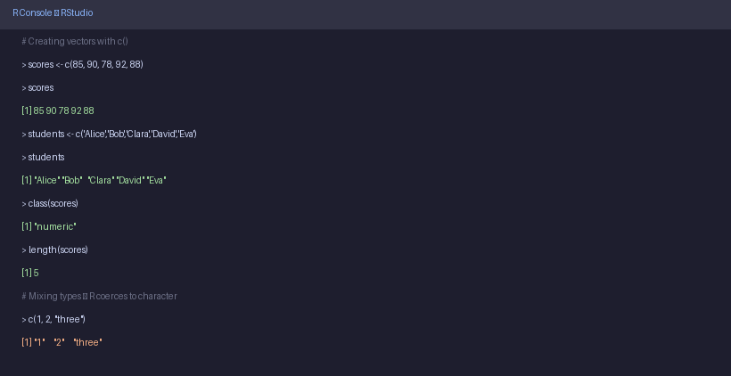
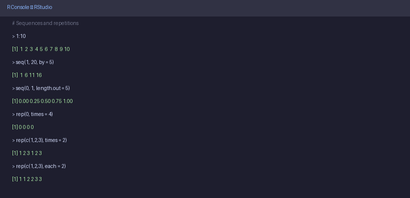
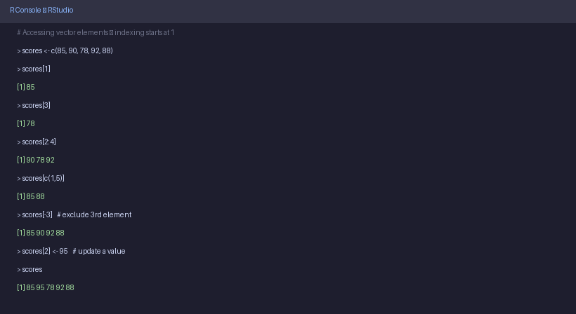
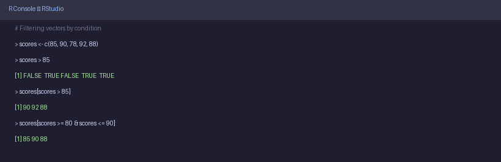
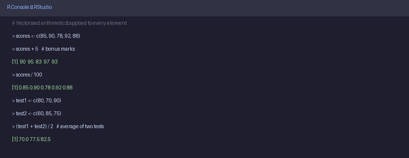
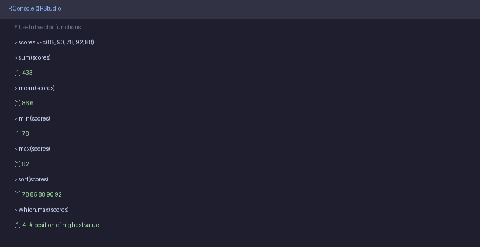

# 📊 05b — Vectors

> **Author:** RP &nbsp;|&nbsp; [@priyasaivasan](https://github.com/priyasaivasan)

---

## 📌 What is a Vector?

> **In plain English:** A vector is a row of values of the same type, stored in order. Think of it like a single column in a spreadsheet — all entries must be the same kind (all numbers, all names, or all true/false).

If a variable is one box holding one value, a vector is a shelf of boxes — all the same type, lined up in order.

```
scores:  [ 85 | 90 | 78 | 92 | 88 ]
          1    2    3    4    5       ← position numbers (called index)
```

You create a vector using `c()` — the `c` stands for **combine**.

---

## 🖥️ Creating Vectors — Examples in RStudio



```r
# A numeric vector — exam scores
scores <- c(85, 90, 78, 92, 88)
scores
# [1] 85 90 78 92 88

# A character vector — student names
students <- c("Alice", "Bob", "Clara", "David", "Eva")
students
# [1] "Alice" "Bob"   "Clara" "David" "Eva"

# A logical vector
passed <- c(TRUE, TRUE, FALSE, TRUE, TRUE)
passed
# [1]  TRUE  TRUE FALSE  TRUE  TRUE

# Check the type
class(scores)
# [1] "numeric"

class(students)
# [1] "character"

# How many elements?
length(scores)
# [1] 5
```

> ⚠️ **Vectors must be one type.** If you mix types, R quietly converts everything to the most flexible type. For example, `c(1, 2, "three")` becomes all character — `"1" "2" "three"`. This is called **coercion**.

---

## 🔢 Sequences & Repetitions

> You don't always have to type every value. R has shortcuts for creating sequences.



```r
# Sequence from 1 to 10
1:10
# [1]  1  2  3  4  5  6  7  8  9 10

# Sequence with a step
seq(1, 20, by = 5)
# [1]  1  6 11 16

# Exactly n values between two numbers
seq(0, 1, length.out = 5)
# [1] 0.00 0.25 0.50 0.75 1.00

# Repeat a value
rep(0, times = 4)
# [1] 0 0 0 0

# Repeat a vector
rep(c(1, 2, 3), times = 2)
# [1] 1 2 3 1 2 3

rep(c(1, 2, 3), each = 2)
# [1] 1 1 2 2 3 3
```

---

## 🎯 Accessing Elements (Indexing)

> **What's happening:** Every element in a vector has a position number starting from 1. You use square brackets `[ ]` to pull out specific elements.

> 💡 **Important:** R starts counting from **1**, not 0 like Python or Java.



```r
scores <- c(85, 90, 78, 92, 88)

# Get the 1st element
scores[1]
# [1] 85

# Get the 3rd element
scores[3]
# [1] 78

# Get elements 2 through 4
scores[2:4]
# [1] 90 78 92

# Get specific elements (1st and 5th)
scores[c(1, 5)]
# [1] 85 88

# Exclude an element (drop the 3rd)
scores[-3]
# [1] 85 90 92 88

# Change the 2nd value
scores[2] <- 95
scores
# [1] 85 95 78 92 88
```

---

## 🔎 Filtering with Conditions

> **What's happening:** You can ask R "give me all elements where a condition is true." This is one of the most powerful things vectors can do.



```r
scores <- c(85, 90, 78, 92, 88)

# Which scores are above 85?
scores > 85
# [1] FALSE  TRUE FALSE  TRUE  TRUE

# Get only those scores
scores[scores > 85]
# [1] 90 92 88

# Scores between 80 and 90
scores[scores >= 80 & scores <= 90]
# [1] 85 90 88

# Students named "Alice" or "Clara"
students <- c("Alice", "Bob", "Clara", "David", "Eva")
students[students == "Alice" | students == "Clara"]
# [1] "Alice" "Clara"
```

---

## ➕ Vector Arithmetic

> **What's happening:** When you do math on a vector, R applies the operation to **every element** automatically. This is called **vectorisation** — it's one of R's superpowers.



```r
scores <- c(85, 90, 78, 92, 88)

# Add 5 bonus marks to everyone
scores + 5
# [1]  90  95  83  97  93

# Percentage out of 100
scores / 100
# [1] 0.85 0.90 0.78 0.92 0.88

# Two vectors of same length — element by element
test1 <- c(80, 70, 90)
test2 <- c(60, 85, 75)

test1 + test2
# [1] 140 155 165

# Average of two tests
(test1 + test2) / 2
# [1] 70.0 77.5 82.5
```

---

## 📐 Useful Vector Functions



```r
scores <- c(85, 90, 78, 92, 88)

sum(scores)       # Total: 433
mean(scores)      # Average: 86.6
min(scores)       # Lowest: 78
max(scores)       # Highest: 92
range(scores)     # Min and Max: 78 92
median(scores)    # Middle value: 88
sd(scores)        # Standard deviation: 5.18
length(scores)    # Number of elements: 5
sort(scores)      # Sorted: 78 85 88 90 92
rev(scores)       # Reversed: 88 92 78 90 85
which.max(scores) # Index of highest: 4
which.min(scores) # Index of lowest: 3
```

---

## ✏️ Try It Yourself

**Exercise — Vectors**

In RStudio, try this step by step:

1. Create a vector `temps` with these daily temperatures (in °C): `32, 35, 30, 28, 33, 36, 29`
2. Find the average temperature using `mean()`.
3. Find the highest and lowest using `max()` and `min()`.
4. Get only the days where temperature was **above 32**.
5. Add `2` to every temperature (imagine a heatwave) — what does the new vector look like?
6. Sort the temperatures from lowest to highest.

<details>
<summary>💡 Click to reveal answers</summary>

```r
# 1
temps <- c(32, 35, 30, 28, 33, 36, 29)

# 2
mean(temps)
# [1] 31.86

# 3
max(temps)   # [1] 36
min(temps)   # [1] 28

# 4
temps[temps > 32]
# [1] 35 33 36

# 5
temps + 2
# [1] 34 37 32 30 35 38 31

# 6
sort(temps)
# [1] 28 29 30 32 33 35 36
```

</details>

---

## ⬅️ [Back: Variables](05_variables.md) &nbsp;|&nbsp; [➡️ Next: Matrices](06_matrices.md)
