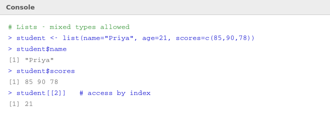
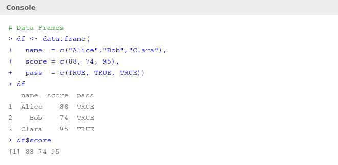

# 🗂️ 06 — Lists and Data Frames

> **Author:** RP &nbsp;|&nbsp; [@priyasaivasan](https://github.com/priyasaivasan)

---

## 📋 Lists

> **What's happening:** A list is like a vector but without the "same type" restriction. A list can hold **anything** — numbers, strings, vectors, even other lists. It's R's most flexible container.



### Creating a List
```r
student <- list(
  name   = "Priya",
  age    = 21,
  scores = c(85, 90, 78)
)
```

### Accessing List Elements

| Method | Code | Returns |
|--------|------|---------|
| By name with `$` | `student$name` | `"Priya"` |
| By name with `[[]]` | `student[["age"]]` | `21` |
| By index | `student[[3]]` | `85 90 78` |
| Subset (keeps list) | `student[1]` | a list with just name |

> 💡 **`$` vs `[[]]` vs `[]`** — Use `$` or `[[]]` to *extract* the actual value. Use `[]` to get a *smaller list* back.

### Modifying a List
```r
# Add a new element
student$grade <- "A"

# Update an existing element
student$age <- 22

# Remove an element
student$grade <- NULL
```

---

## 📊 Data Frames

> **What's happening:** A data frame is R's equivalent of a spreadsheet or database table. Each **column** is a vector (same type within column), but **different columns can have different types**. This is what you'll use most often for real data.



### Creating a Data Frame
```r
df <- data.frame(
  name  = c("Alice", "Bob", "Clara"),
  score = c(88, 74, 95),
  pass  = c(TRUE, TRUE, TRUE)
)
```

### Exploring a Data Frame

| Function | What it shows |
|----------|--------------|
| `head(df)` | First 6 rows |
| `tail(df)` | Last 6 rows |
| `str(df)` | Structure — types of each column |
| `summary(df)` | Statistical summary |
| `nrow(df)` | Number of rows |
| `ncol(df)` | Number of columns |
| `names(df)` | Column names |

### Accessing Data Frame Elements
```r
df$score          # entire score column → 88 74 95
df[1, ]           # entire first row
df[ , 2]          # entire second column
df[2, 3]          # row 2, column 3
df[df$score > 80, ] # rows where score > 80
```

### Adding Columns
```r
df$grade <- c("B", "C", "A")
```

---

## 🆚 Quick Comparison: Vector vs List vs Data Frame

| Feature | Vector | List | Data Frame |
|---------|--------|------|------------|
| Types | One type only | Any mix | One type per column |
| Dimensions | 1D | 1D (nested) | 2D (rows × cols) |
| Best for | Numbers/stats | Mixed data | Tabular/real data |
| Access | `v[1]` | `l$name` | `df$col`, `df[r,c]` |

---

## ⬅️ [Back: Variables & Vectors](05_variables_vectors_matrices.md) &nbsp;|&nbsp; [➡️ Next: Functions](07_functions.md)
