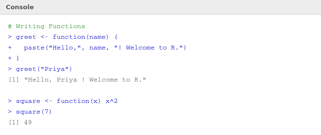

# ⚙️ 07 — Functions

> **Author:** RP &nbsp;|&nbsp; [@priyasaivasan](https://github.com/priyasaivasan)

---

## 🧠 What is a Function?

A function is a **named, reusable block of code** that takes some input, does something with it, and gives back an output. Instead of writing the same logic over and over, you write it once as a function and call it whenever you need it.

> 💡 **Real-world analogy:** A coffee machine is a function. You put in water and beans (inputs), it runs a process, and gives you coffee (output). You don't need to know *how* it works every time — you just press the button.

---

## 🔧 Writing Your First Function

```r
# Basic structure
function_name <- function(argument1, argument2) {
  # code goes here
  return(result)
}
```



### Simple Examples
```r
# A greeting function
greet <- function(name) {
  paste("Hello,", name, "! Welcome to R.")
}
greet("Priya")
# [1] "Hello, Priya ! Welcome to R."

# A squaring function
square <- function(x) x^2
square(7)
# [1] 49

# A function with two arguments
add <- function(a, b) {
  a + b
}
add(4, 6)
# [1] 10
```

---

## 🎛️ Function Arguments

### Default Arguments
```r
# b defaults to 10 if not provided
power <- function(base, exp = 2) {
  base ^ exp
}
power(3)      # uses default exp = 2 → 9
power(3, 3)   # overrides → 27
```

### Named Arguments
```r
# You can pass args in any order using names
power(exp = 3, base = 2)
# [1] 8
```

---

## 🔄 The `return()` Statement

R **automatically returns the last evaluated expression** — so `return()` is optional but good practice for clarity.

```r
# These are equivalent:
double <- function(x) x * 2

double <- function(x) {
  return(x * 2)
}
```

---

## 📦 Built-in Functions You'll Use Constantly

| Function | What it does | Example |
|----------|-------------|---------|
| `sum()` | Total of values | `sum(c(1,2,3))` → `6` |
| `mean()` | Average | `mean(c(1,2,3))` → `2` |
| `max()` / `min()` | Largest/smallest | `max(c(5,2,9))` → `9` |
| `round()` | Round decimals | `round(3.567, 2)` → `3.57` |
| `paste()` | Join text | `paste("Hi", "Priya")` |
| `nchar()` | String length | `nchar("hello")` → `5` |
| `abs()` | Absolute value | `abs(-7)` → `7` |
| `seq()` | Generate sequence | `seq(1, 10, by=2)` |
| `rep()` | Repeat values | `rep(0, 5)` → `0 0 0 0 0` |

---

## ⬅️ [Back: Lists & Data Frames](06_lists_dataframes.md) &nbsp;|&nbsp; [➡️ Next: Control Structures](08_control_structures.md)
