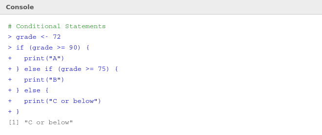
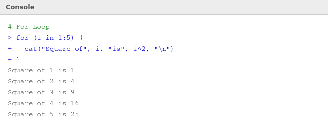

# 🔀 08 — Control Structures

> **Author:** RP &nbsp;|&nbsp; [@priyasaivasan](https://github.com/priyasaivasan)

---

## 🧠 What Are Control Structures?

By default, R runs code top to bottom, line by line. **Control structures** let you change that flow — making decisions, repeating tasks, or skipping steps based on conditions.

---

## ✅ if / else — Making Decisions

> **What's happening:** R checks a condition. If it's `TRUE`, it runs one block of code. If it's `FALSE`, it runs another. Like a fork in the road.



### Structure
```r
if (condition) {
  # runs when condition is TRUE
} else if (another_condition) {
  # runs when first is FALSE but this is TRUE
} else {
  # runs when everything above is FALSE
}
```

### Example
```r
grade <- 72

if (grade >= 90) {
  print("A")
} else if (grade >= 75) {
  print("B")
} else {
  print("C or below")
}
# [1] "C or below"
```

### `ifelse()` — Vectorised Version
```r
# Works on entire vectors at once
scores <- c(85, 60, 92, 45, 78)
ifelse(scores >= 75, "Pass", "Fail")
# [1] "Pass" "Fail" "Pass" "Fail" "Pass"
```

---

## 🔁 for Loop — Repeating Tasks

> **What's happening:** A `for` loop repeats a block of code for each item in a sequence.



```r
for (i in 1:5) {
  cat("Square of", i, "is", i^2, "\n")
}
# Square of 1 is 1
# Square of 2 is 4
# Square of 3 is 9
# Square of 4 is 16
# Square of 5 is 25
```

### Looping over a vector
```r
fruits <- c("apple", "banana", "cherry")

for (fruit in fruits) {
  print(paste("I like", fruit))
}
# [1] "I like apple"
# [1] "I like banana"
# [1] "I like cherry"
```

---

## 🔄 while Loop — Repeat Until

> **What's happening:** A `while` loop keeps running as long as a condition is `TRUE`. Be careful — if the condition never becomes `FALSE`, you get an infinite loop!

```r
count <- 1

while (count <= 5) {
  print(count)
  count <- count + 1
}
# [1] 1
# [1] 2
# [1] 3
# [1] 4
# [1] 5
```

---

## ⏭️ break and next

```r
# break — exit loop early
for (i in 1:10) {
  if (i == 5) break
  print(i)
}
# Prints 1 2 3 4, then stops

# next — skip current iteration
for (i in 1:6) {
  if (i %% 2 == 0) next  # skip even numbers
  print(i)
}
# Prints 1 3 5
```

---

## 📊 Quick Reference

| Structure | Use when |
|-----------|----------|
| `if / else` | Making a decision based on a condition |
| `ifelse()` | Applying a decision to an entire vector |
| `for` | You know how many times to repeat |
| `while` | You repeat until something changes |
| `break` | You need to exit a loop early |
| `next` | You want to skip one iteration |

> 💡 **R tip:** Loops are fine for learning, but once you're comfortable, try to use **vectorised operations** instead — they're faster and more R-idiomatic.

---

## ⬅️ [Back: Functions](07_functions.md) &nbsp;|&nbsp; [🏠 Back to Home](../README.md)
